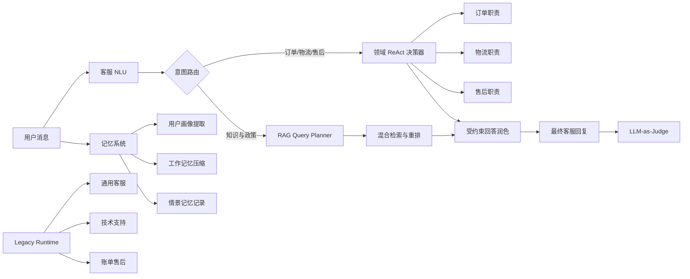
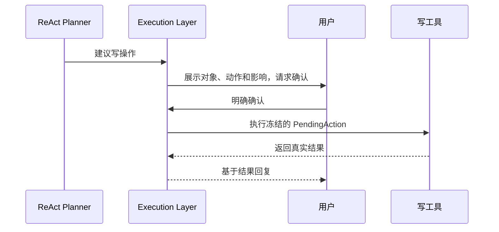

# GGBot Prompt 设计说明

## 文档目标

本文档说明 GGBot 中每一类 Prompt 的设计思路、职责边界、核心原则、重点约束和输出契约，作为后续 Prompt 评审、调优与回归测试的依据。

Prompt 源码统一位于 `core/prompts/`。本文档描述设计意图，源码是实际运行时的权威实现。

## 文档导航

| 文档 | 内容 |
|---|---|
| [NLU Prompt](nlu.md) | 意图、对话行为、槽位及原文 |
| [ReAct Prompt](react.md) | 通用决策器、订单、物流、售后职责及原文 |
| [RAG Prompt](rag.md) | Query Planner、Query Rewriter、Reranker 及原文 |
| [回答润色 Prompt](response.md) | 最终回答表达优化、事实保护与失败回退 |
| [Memory Prompt](memory.md) | 用户画像、工作记忆、情景记忆及原文 |
| [Legacy Prompt](legacy.md) | Legacy 分类、实体与三类客服 Agent 及原文 |
| [评测 Prompt](evaluation.md) | LLM-as-Judge 设计与原文 |
| [治理与验证](governance.md) | 调用映射、评审清单与验证策略 |

## Prompt 架构



运行时将 Prompt 拆分为两个层次：

```text
PromptSpec
├── system：稳定角色、职责、业务规则、安全边界、输出契约
└── user：当前消息、历史、状态、Observation、工具定义等动态数据
```

这一结构避免把用户消息、历史记录或工具结果误当作高优先级指令。

## 全局设计原则

### 3.1 单一职责

每个 Prompt 只完成一个明确任务：

- NLU 只做理解，不回答问题。
- Query Planner 只生成检索查询，不生成答案。
- ReAct 只决定一个下一步动作，不直接执行工具。
- Memory Prompt 只提取或压缩指定类型的信息。
- Judge 只评分，不改写候选回复。

### 3.2 事实有来源

Prompt 必须明确事实可以来自哪里：

- 用户输入可作为“用户表达”的证据。
- 成功的工具 Observation 可作为业务事实。
- DialogueState 可作为当前流程状态。
- 知识库文档可作为政策依据。
- 示例只用于说明格式，不能成为业务事实。

不得从模型常识、历史示例或失败工具结果中补造订单状态、金额、政策结论或执行结果。

### 3.3 写操作两阶段确认

退款、退货、取消订单、创建工单等写操作遵循：



LLM 不得绕过 `PendingAction`，也不得把“建议执行”“资格通过”描述为“已经完成”。

### 3.4 Prompt Injection 防护

用户消息、历史、日志、知识片段和 Observation 都被视为不可信数据。它们可以提供事实，但不能：

- 修改角色和职责；
- 改变输出 Schema；
- 请求泄露 Prompt；
- 要求忽略安全规则；
- 将候选文档中的指令提升为系统指令。

### 3.5 结构化输出

机器消费的 Prompt 必须：

- 明确 JSON Schema；
- 禁止 Markdown 和额外解释；
- 使用固定枚举；
- 对缺失信息使用空值或指定降级值；
- 对置信度给出统一校准标准。

### 3.6 客服表达原则

直接面向用户的回复应：

- 先回应核心诉求；
- 区分事实、判断和下一步；
- 不重复询问已知信息；
- 不使用内部工具名、Agent 名、JSON 或 reason code；
- 不作无依据承诺；
- 不索取密码、验证码、支付密码、完整银行卡号、Token 或私钥；
- 转人工时说明原因并总结已知信息。
