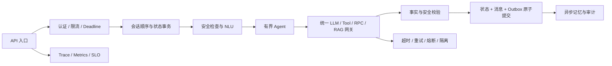
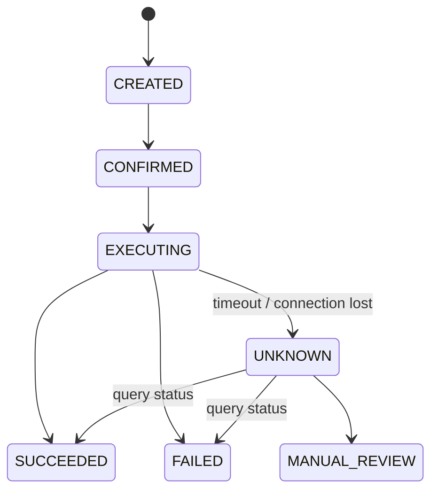

# GGBot Top 10 稳定性改进指南

> 目标：只保留 GGBot 最重要的十个稳定性问题，并给出可落地的最佳方案。  
> 说明：目标方案不代表当前仓库已经实现。  
> 排序：先防止资金、权限和状态错误，再提高可用性与恢复能力。

## 1. 总体架构



核心原则：

```text
判断操作是否有副作用
  -> 判断错误是否可恢复
  -> 检查剩余 Deadline
  -> 选择重试、降级、状态查询、拒绝或人工接管
```

## 2. Top 10 总览

| 排名 | 稳定性要点 | 主要风险 | 最佳方案 |
|---:|---|---|---|
| 1 | 写操作副作用安全 | 重复退款、错误取消、结果未知 | 下游最终幂等 + UNKNOWN 状态查询 |
| 2 | 会话一致性与原子提交 | 消息乱序、状态覆盖、部分提交 | 顺序处理 + Fencing Token + CAS + Outbox |
| 3 | 身份认证与资源授权 | 越权查询、替他人操作 | 可信身份 + 资源归属校验 |
| 4 | Deadline 与过载保护 | 请求无限等待、故障雪崩 | 请求预算 + 限流 + Bulkhead |
| 5 | Tool 与 RPC 韧性 | 下游故障拖垮主服务 | 分类超时、有限重试、熔断 |
| 6 | LLM 可用性 | 模型故障导致全链路不可用 | LLM Gateway + 主备 + 确定性降级 |
| 7 | NLU 与未知意图 | 误识别触发错误操作 | Fast Track + 风险阈值 + 澄清 |
| 8 | RAG 可靠性 | 无证据乱答、单组件故障 | 多路降级 + 引用校验 + 拒答 |
| 9 | 输入输出安全 | 注入、危险请求、敏感信息 | Safety Gateway + PII 脱敏 |
| 10 | 可观测与发布恢复 | 故障不可发现、版本扩大影响 | SLO + Readiness + 金丝雀 + 演练 |

---

## 3. Top 1：写操作副作用安全

### 风险

退款、退货、取消订单等操作不能重复执行。最危险的情况是下游已经成功，但响应返回前连接中断。此时 timeout 只表示“结果未知”，不能解释为失败。

### 最佳方案

`action_id` 贯穿完整链路：

```text
PendingAction -> 用户确认 -> GGBot 执行记录
  -> RPC 请求 -> 下游数据库唯一键 -> 最终状态查询
```

下游必须提供：

```text
CreateRefund(action_id, order_id, reason)
GetRefundByActionID(action_id)
```

并建立数据库唯一约束：

```sql
CREATE UNIQUE INDEX uk_refund_action_id
ON refund_request(action_id);
```

写操作状态机：



### 故障行为

- 用户未确认：不调用写 RPC；
- 业务明确拒绝：不重试；
- RPC timeout：进入 UNKNOWN，使用原 `action_id` 查询；
- 幂等存储不可用：停止写操作；
- 参数冲突：失败关闭并告警。

### 验收

- 重复请求不会重复退款；
- timeout 后不会直接报告成功或失败；
- Redis 过期或应用重启后，下游仍能按 `action_id` 去重。

---

## 4. Top 2：会话一致性与原子提交

### 风险

同一会话并发可能导致消息乱序、旧状态覆盖新状态。状态、消息和记忆分别写入时，还可能出现“状态成功但消息丢失”。

### 最佳方案

长期使用按 `conv_id` 分区的顺序队列。保留同步 HTTP 时，至少使用：

```text
Redis Lock
  + Fencing Token
  + state_version CAS
  + 提交前所有权检查
```

锁续租失败后，原请求必须停止工具调用和提交：

```python
if lock.is_lost:
    raise ConversationOwnershipLost()

saved = await state_store.compare_and_set(
    expected_version=current.state_version,
    fencing_token=lock.fencing_token,
    new_state=next_state,
)
```

一次事务原子提交：

```text
ConversationState
UserMessage
AssistantMessage
RequestResult
OutboxEvent
```

摘要、画像、情景记忆通过 Outbox 异步执行。

### 故障行为

- 状态事务失败：整个 Turn 失败；
- CAS 冲突：重新读取或返回会话冲突；
- 失去锁：禁止提交；
- 记忆写入失败：主请求成功，异步重试；
- 相同 `request_id`：返回已保存结果。

### 验收

- 同一会话严格顺序；
- 不存在部分提交；
- Chroma 或记忆 LLM 故障不影响主回复。

---

## 5. Top 3：身份认证与资源授权

### 风险

如果直接信任请求中的 `user_id` 或订单号，用户可能查询他人订单、替他人退款，或者访问 Trace、Skill、知识管理等内部接口。

### 最佳方案

```text
可信凭证
  -> 服务端解析 user_identity
  -> 不信任请求体 user_id
  -> RPC 校验订单/物流/售后资源归属
  -> 管理接口使用独立角色权限
```

角色至少区分：

- 普通用户；
- 客服人员；
- 运营人员；
- 系统管理员；
- 服务账号。

订单归属必须由权威业务服务校验。写操作在创建 PendingAction 前和实际执行前各校验一次。

### 故障行为

- 未认证：401；
- 无权限：403；
- 权限系统不可用：敏感查询和写操作失败关闭；
- 权限拒绝：不能重试或通过降级绕过。

### 验收

- 请求不能伪造 `user_id`；
- 用户不能操作他人订单；
- 管理接口不暴露给普通用户；
- 权限变更有审计记录。

---

## 6. Top 4：全链路 Deadline 与过载保护

### 风险

如果每个 Tool 都允许 30 秒，一次请求连续调用三个 Tool 可能等待 90 秒。慢请求会占满 Worker、连接池和 LLM 配额，最终引发雪崩。

### 最佳方案

入口创建统一请求上下文：

```python
@dataclass(frozen=True)
class RequestContext:
    request_id: str
    trace_id: str
    deadline_monotonic: float

    def remaining_seconds(self) -> float:
        return max(0.0, self.deadline_monotonic - time.monotonic())
```

子调用超时：

```text
actual_timeout =
    min(policy_timeout, remaining_time - commit_reserve)
```

建议 `/chat` 初始总 Deadline 为 12～15 秒，至少保留 500ms 提交状态。

同时增加：

- 用户、租户和全局限流；
- LLM Token 配额；
- 单会话并发限制；
- 请求大小和历史长度限制；
- 系统过载时快速返回 429/503；
- NLU、Planner、RPC、Memory 使用独立 Bulkhead。

### 验收

- Deadline 耗尽后不再发起新调用；
- 单个慢依赖不会占满全部连接；
- 过载时快速拒绝，不让所有请求一起超时；
- 重试总耗时不会突破 Deadline。

---

## 7. Top 5：Tool 与 RPC 韧性

### 风险

读取和写入使用同一种重试策略，会造成无意义重试或重复副作用。持续故障还可能耗尽线程和连接。

### 最佳方案

每个 Tool 声明操作类型：

```python
class OperationClass(str, Enum):
    READ_IDEMPOTENT = "read_idempotent"
    WRITE_IDEMPOTENT = "write_idempotent"
    CRITICAL_STATE = "critical_state"
    OPTIONAL = "optional"
```

统一 `DependencyGateway` 管理：

```python
class ResiliencePolicy(BaseModel):
    timeout_s: float
    max_attempts: int
    retryable_errors: set[str]
    circuit_failure_threshold: int
    circuit_recovery_s: float
    max_concurrency: int
    fallback_name: str | None
```

只读 RPC 仅对连接失败、timeout、429 和部分 5xx 重试，最多 2～3 次总尝试，并使用指数退避和 jitter。

以下错误不重试：

- 参数错误；
- 401/403；
- 资源不存在；
- 业务拒绝；
- Schema 不兼容。

写 RPC 不使用普通重试，进入 Top 1 的 UNKNOWN 流程。

熔断器按“依赖 + 操作”隔离，HALF_OPEN 只放行少量探针。

### 验收

- 瞬时只读故障可自动恢复；
- 参数和权限错误不会重试；
- 持续故障会熔断；
- 每个 Tool 有输入、输出 Schema 和稳定错误码。

---

## 8. Top 6：LLM 可用性与确定性降级

### 风险

NLU、Planner、RAG Answer、Polisher、摘要分别直接调用模型，会导致超时、重试、主备和指标策略不一致。

### 最佳方案

建设统一 LLM Gateway：

```text
业务模块
  -> Task 路由
  -> Deadline / Retry Budget
  -> Circuit Breaker / Bulkhead
  -> Primary / Secondary Model
  -> Tool Calling / Schema Validation
  -> Token / Cost Metrics
```

推荐基线：

| 场景 | 超时 | 总尝试 | 降级 |
|---|---:|---:|---|
| NLU | 4s | 2 | Fast Track / 澄清 |
| ReAct Planner | 5s | 2 | 确定性流程 / 人工 |
| Query Planner | 3s | 2 | 原始 Query |
| RAG Answer | 8s | 2 | 抽取式回答 / 拒答 |
| ResponsePolisher | 3s | 1 | 原回答 |
| 摘要和画像 | 异步 10s | 3 | 固定摘要 / 跳过 |

备用模型必须支持相同 Tool Calling 和 Pydantic Schema，不能因切换模型而放宽权限、事实和安全校验。

### 验收

- LLM 全部不可用时，确定性订单查询仍可工作；
- NLU 失败不会执行高风险操作；
- Polisher 失败返回原回答；
- 可观测每类任务的超时、降级、Token 和费用。

---

## 9. Top 7：NLU 与未知意图安全

### 风险

最严重的误判是把政策咨询识别成退款申请，或把低置信度结果当作确定写意图。

### 最佳方案

```text
Fast Track
  -> Structured NLU
  -> Schema 校验
  -> 槽位原文 Grounding
  -> 业务对象校验
  -> 风险分层阈值
  -> 接受或澄清
```

建议阈值：

| 类型 | 阈值 | 低于阈值 |
|---|---:|---|
| 问候、FAQ | 0.60 | unknown |
| 订单、物流 | 0.70 | 确认目标 |
| 账户、支付 | 0.80 | 核验或人工 |
| 退款、退货、取消 | 0.90 | 不创建 PendingAction |

显式区分：

- `unknown`：无法理解，提供有限选项；
- `out_of_scope`：超出客服范围；
- `unsafe`：危险内容，安全拒答；
- `unsupported`：属于客服但暂不支持，转人工。

### 验收

- 低置信度写意图绝不执行；
- 槽位必须来自原文或已核验状态；
- unknown 不调用写工具；
- 多轮补槽不会丢失 active_intent。

---

## 10. Top 8：RAG 可用性与事实可靠性

### 风险

Dense、BM25、Reranker 或 Answer LLM 任一故障都可能影响回答；更严重的是没有证据时模型继续猜测。

### 最佳方案

```text
Query Planner 失败 -> 原始 Query
Dense 失败         -> BM25
BM25 失败          -> Dense
Reranker 失败      -> RRF 原排序
无相关证据         -> 明确拒答
Answer 校验失败    -> 抽取式回答或拒答
```

必须区分错误：

```text
rag_unavailable
rag_no_relevant_evidence
rag_version_incomplete
rag_answer_validation_failed
```

索引发布采用版本化构建：

```text
解析 -> Chunk -> Embedding -> 新索引
  -> 离线质量检查 -> 原子切换 active_version
```

新版本失败时旧索引继续服务。

### 验收

- Dense 或 BM25 单路故障时仍可检索；
- Reranker 故障可回退 RRF；
- 无证据时不使用模型常识补答；
- 每个事实段有合法引用；
- 索引可灰度和回滚。

---

## 11. Top 9：输入输出安全

### 风险

用户、历史消息、RAG 文档和 Tool Observation 都是不可信输入，可能包含 Prompt Injection、恶意指令或敏感凭证。

### 最佳方案

输入链路：

```text
输入规范化
  -> PII / 凭证检测
  -> Prompt Injection 检测
  -> 内容风险分类
  -> 业务范围分类
  -> NLU
```

输出链路：

```text
事实校验
  -> 完成阶段校验
  -> 引用校验
  -> PII 脱敏
  -> 内容安全复检
```

以下规则必须由代码执行，不能只存在于 Prompt：

- Agent 工具白名单；
- READ/WRITE 分类；
- 用户确认门禁；
- 资源权限；
- PII 脱敏；
- 高风险请求拒绝；
- 审计事件。

### 故障行为

- 用户发送密码、Token：不进入长期记忆；
- Prompt Injection：视为普通数据；
- RAG 文档含指令：只作为证据；
- 疑似盗号或资金风险：停止自动写操作；
- 输出新增事实：丢弃生成结果，返回安全原回复。

### 验收

- 凭证不会进入日志和长期记忆；
- Injection 无法扩大工具权限；
- 输出不能把“待确认”改成“已完成”；
- 高风险请求有稳定拒答和审计记录。

---

## 12. Top 10：可观测、发布与恢复

### 风险

没有统一观测时，无法判断哪个依赖故障、系统是否大量降级、是否存在 UNKNOWN 写操作，也无法安全放量和回滚。

### 最佳方案

统一记录：

```text
trace_id / request_id / stage
dependency / operation / attempt
timeout_ms / latency_ms / error_kind
fallback_used / circuit_state / result_unknown
agent / intent / risk_level
```

核心 SLO：

| SLO | 初始目标 |
|---|---:|
| `/chat` 可用性 | 99.9% |
| 普通 Turn P95 | < 5s |
| 写操作重复执行 | 0 |
| 写操作 UNKNOWN 率 | < 0.1% |
| 状态提交成功率 | > 99.99% |
| 高风险意图未确认执行 | 0 |
| RAG 引用支持率 | > 99% |
| 凭证进入长期存储 | 0 |

健康检查拆分：

- `/live`：进程存活；
- `/ready`：Redis、状态存储和关键组件可服务；
- `/health/details`：受权限保护的依赖详情。

发布采用金丝雀 1% → 5% → 25% → 100%，同时观察成功率、P95、降级率和 UNKNOWN 率。Prompt、模型和 RAG 索引使用独立 Feature Flag。

### 验收

- 任一失败可通过 Trace 定位；
- 降级率和 UNKNOWN 率异常会告警；
- Readiness 失败后实例停止接流量；
- 新版本异常可自动停止放量或回滚；
- 定期演练 LLM、Redis、RPC 和 RAG 故障。

---

## 13. 实施顺序

### P0：先保证不会做错

1. 写操作最终幂等和 UNKNOWN；
2. 会话 CAS、Fencing Token 和原子提交；
3. 身份认证和资源授权；
4. 写操作相关安全门禁。

验收目标：不会越权、不会重复写、不会虚假报告完成。

### P1：再保证依赖故障不会扩散

1. 全链路 Deadline、限流和 Bulkhead；
2. 统一 Tool/RPC 策略；
3. LLM Gateway；
4. RAG 分层降级。

验收目标：单一依赖故障不会拖垮整个系统。

### P2：最后完善质量和运营

1. NLU 风险阈值与未知意图分类；
2. SLO、Readiness、金丝雀和故障演练；
3. 记忆、画像和审计 Outbox 异步化。

验收目标：系统可观测、可灰度、可回滚、可恢复。

## 14. 最终建议

优先建设三个统一基础组件：

```text
RequestContext
  统一 request_id、身份、Deadline 和 Trace

DependencyGateway
  统一错误、超时、重试、熔断、Bulkhead 和降级

Transactional Commit + Outbox
  统一状态、消息、请求结果和异步事件提交
```

业务 Agent 负责业务目标、工具选择和用户交互；基础设施负责保证调用有界、状态一致、重试安全、故障隔离和结果可恢复。
