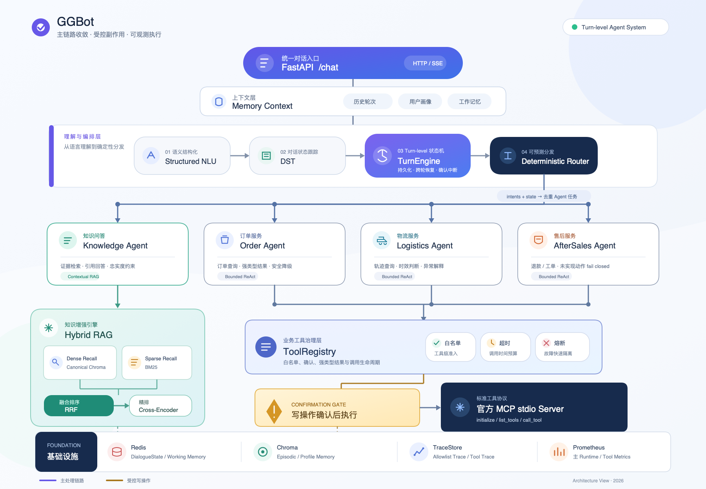
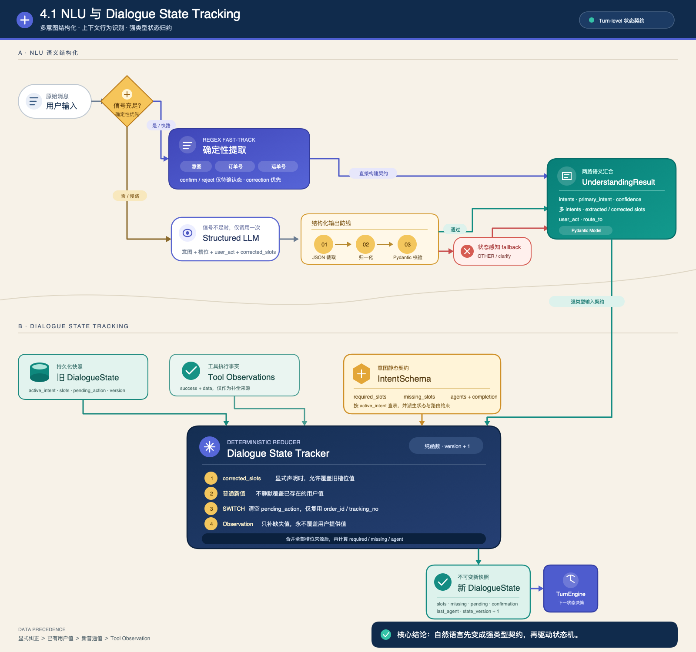
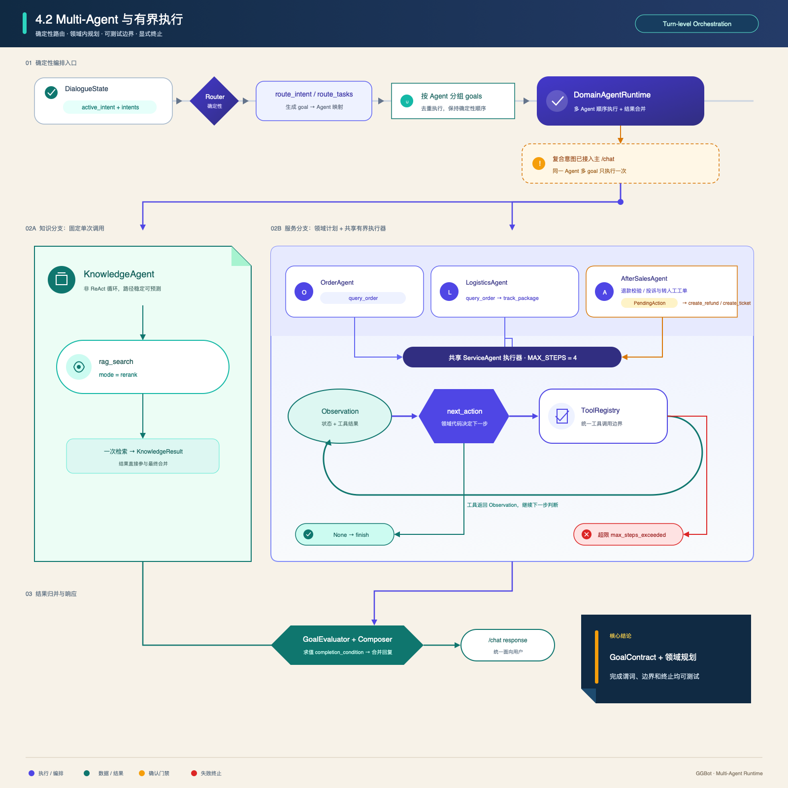
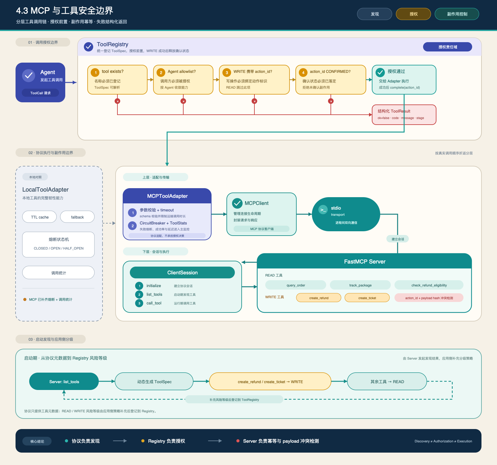
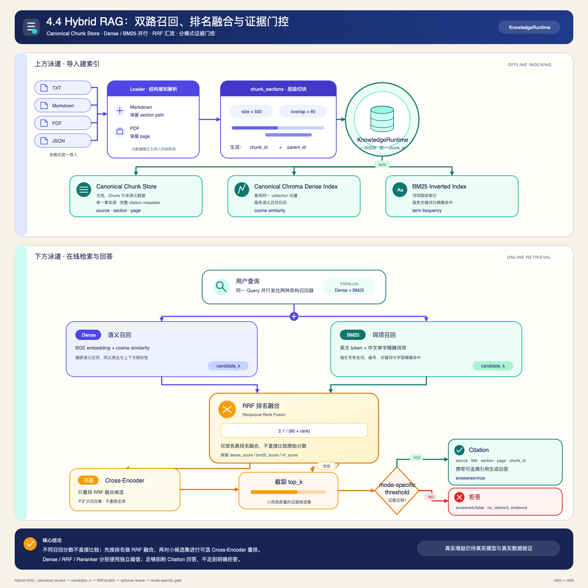
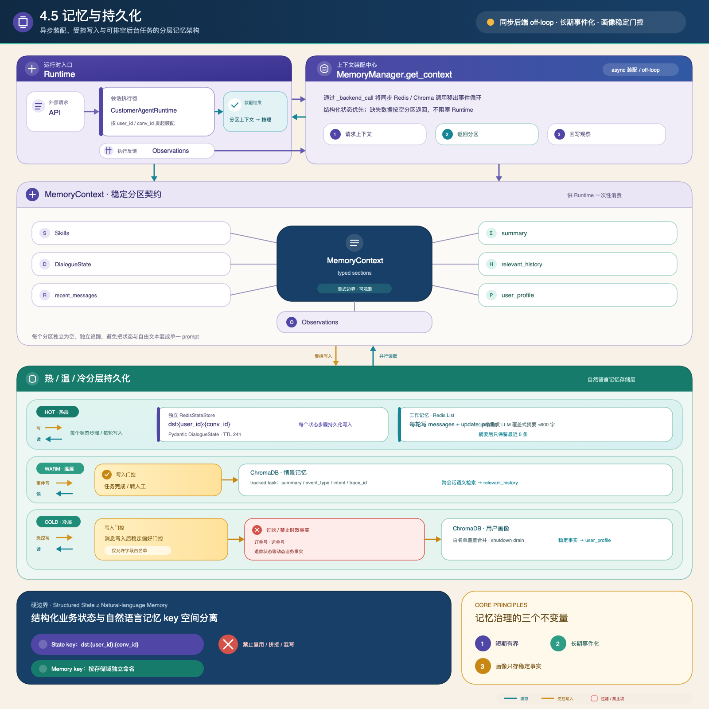

# GGBot 当前版本技术实现

> Turn-level Agent Runtime · Standard MCP · Hybrid RAG · Persistent Memory
>
> 技术说明与[飞书更新副本](https://bytedance.sg.larkoffice.com/docx/KsZ7dMeVUotli3xg2AilbhaCgeg) revision 17 对齐；原文档保持不变，本次审计源为原文 revision 54。

| 项目     | 内容                      | 项目     | 内容                              |
| -------- | ------------------------- | -------- | --------------------------------- |
| 当前版本 | `feat-v1 / 7d7397a`          | 核心场景 | 退款申请与人工工单确认闭环        |
| 验证结果 | 277 passed · 1 warning       | 技术主线 | 显式状态机 + 多 Agent + MCP + RAG |

> **项目定位**
>
> 这是一个可运行、可解释、面向技术展示的智能客服原型。重点是打通 Agent 业务闭环并展示关键机制，不等同于已经完成鉴权、审计和真实业务接入的生产平台。

## 1. 一页看懂当前版本

| 能力        | 当前实现                                               | 状态           |
| ----------- | ------------------------------------------------------ | -------------- |
| 对话编排    | 自研 TurnEngine，显式状态迁移、暂停与跨轮恢复          | 主链路已落地   |
| 对话理解    | 规则 fast-track + 单次结构化 LLM + 安全降级            | 主链路已落地   |
| Multi-Agent | Knowledge、Order、Logistics、AfterSales 四类领域 Agent | 确定性路由     |
| 工具协议    | 官方 MCP SDK、stdio Server、动态工具发现               | 可运行 Demo    |
| 知识检索    | Chroma Dense + BM25 + RRF + Cross-Encoder              | 效果待继续验证 |
| 记忆系统    | Redis 工作记忆与状态，Chroma 情景记忆与画像            | 分层存储       |
| 质量体系    | Trace、Prometheus、277 个测试、50 条离线评测           | 主链路监控已接入 |

### 本次实现更新摘要

| 变化方向 | 当前实现 | 文档调整 |
| --- | --- | --- |
| 业务动作安全 | 退货/取消等未实现动作 fail closed；订单、物流、退款和工单使用强类型业务输出 | 补充能力边界、业务失败与系统失败的区别 |
| 售后闭环 | 投诉与转人工通过 `create_ticket` 进入确认、恢复和幂等链路 | Multi-Agent 图增加退款/工单双分支 |
| 复合意图 | NLU 输出 `intents`，Runtime 按 Agent 分组 goal，并执行 completion condition | 更新 NLU、Router 和结果合并说明 |
| MCP 韧性 | MCP Adapter 已接入参数校验、超时、熔断和调用统计；WRITE 成功后清理确认状态 | 移除“MCP Adapter 未接监控”的旧结论 |
| RAG 一致性 | Chroma collection 成为 canonical chunk store，保留完整引用元数据；Dense/RRF/Reranker 使用独立阈值 | 重绘索引与证据门控图 |
| 异步与可观测性 | 同步 Redis/Chroma/Retriever 调用移出事件循环；后台任务受跟踪并在关停时 drain | 补充 off-loop、任务生命周期和主链路监控 |

### 系统架构



**主运行时。** `POST /chat` 已切换到 `CustomerAgentRuntime → DialogueStateTracker → TurnEngine → DomainAgentRuntime → ToolRegistry`。FAQ 使用固定 RAG 路径；订单、物流和退款使用有界 ServiceAgent；写操作在用户确认前不会执行。

**兼容运行时。** 仓库仍保留早期 `AgentOrchestrator` 与 `MCPToolManager` 供显式 legacy 评测使用，但 `/chat`、`/search`、默认评测、CLI 和在线监控均已迁移到 CustomerAgentRuntime / ToolRegistry。Legacy evaluator 默认不初始化，仅在 `ENABLE_LEGACY_EVAL=true` 时启用。

### 启动装配与模块边界

应用通过 FastAPI lifespan 统一完成运行时装配。启动阶段先读取模型配置和业务 Skills，再建立 Redis 与 ChromaDB 连接；随后构建 KnowledgeRuntime、ToolRegistry 和标准 MCP Client，最后把 Router、领域 Agent、TurnEngine、TraceStore 组装成 CustomerAgentRuntime。MCP Server 连接、监控任务启动或模型初始化失败时，应用不会进入可服务状态，避免请求落到半初始化对象。

**API 层只负责协议与生命周期。** `api/main.py` 处理请求模型、组件初始化、上下文读取和响应序列化，不承载退款判断等业务决策。核心编排集中在 `core/customer_agent_runtime.py`，状态迁移集中在 `core/turn_engine.py`，领域动作集中在 `agents/domain_agents.py`，工具治理集中在 `core/tool_registry.py`。

**业务状态与执行状态分离。** DialogueState 保存 active_intent、slots、missing_slots、pending_action 和 confirmation_status，描述“业务进行到哪里”；TurnContext 保存 execution_state、state_history、observations、step_count 和 response，描述“本轮执行到哪一步”。这种拆分使业务状态可以跨轮持久化，而本轮执行轨迹可以独立限制和观测。

| 模块   | 核心对象                                     | 职责边界                                               |
| ------ | -------------------------------------------- | ------------------------------------------------------ |
| 接入层 | `FastAPI /chat`                              | 请求校验、上下文装配、结果序列化与生命周期管理         |
| 理解层 | `IntentRecognizer`<br>`DialogueStateTracker` | 把自然语言变成结构化理解，并归并为可持久化业务状态     |
| 编排层 | `CustomerAgentRuntime`<br>`TurnEngine`       | 注册状态 handler、执行有界状态循环、处理暂停与失败     |
| 领域层 | `Router`<br>`DomainAgentRuntime`             | 确定性路由，执行一个或多个领域子任务并合并结果         |
| 能力层 | `ToolRegistry`<br>`MCPToolAdapter`           | 工具发现、白名单、参数校验、确认门禁和统一结果模型     |
| 数据层 | Redis / ChromaDB                             | 保存 DialogueState、工作记忆、情景记忆、画像和知识索引 |

## 2. 一次请求如何执行

1. **装配上下文。** API 通过 `user_id + conv_id` 读取最近消息、会话摘要、相关情景记忆、用户画像和 DialogueState。
2. **结构化理解。** 正则 fast-track 优先识别意图、订单号、物流号、确认、拒绝和槽位纠正；信号不足时最多调用一次 LLM，并用 Pydantic 校验输出。
3. **更新业务状态。** DialogueStateTracker 以纯 Reducer 方式合并旧状态与本轮 UnderstandingResult，计算 required_slots 和 missing_slots。
4. **驱动执行状态。** TurnEngine 校验状态边、执行 handler，并在每一步后把 DialogueState 持久化到 Redis。
5. **路由领域 Agent。** Router 根据 active_intent 与本轮 intents 生成 goal → Agent 映射，按 Agent 去重，不增加额外 LLM 调用。
6. **调用工具并返回。** ToolRegistry 检查工具存在性、Agent 白名单和写操作确认状态；API 返回结果、状态、缺失槽位、引用和 trace_id。

### TurnEngine 状态路径

`UNDERSTANDING → CLARIFYING / ROUTING → RETRIEVING / ACTING → AWAITING_CONFIRMATION / RESPONDING → COMPLETED`

**暂停点：** `CLARIFYING` 与 `AWAITING_CONFIRMATION` 会保存状态并等待下一轮输入。**失败点：**异常、非法状态、缺失 handler 或超过 6 步时进入 `FAILED`，生成结构化 HandoffPackage。

### 状态机执行循环

CustomerAgentRuntime 每个请求都会通过 `turn_engine.fork()` 创建独立 handler registry，但复用同一个 StateStore。这样不同请求不会共享临时 handler，同时仍然可以从 Redis 恢复同一会话的 DialogueState。恢复位置不是直接保存 TurnContext，而是由 `resume_state()` 根据 missing_slots、pending_action 和 confirmation_status 推导，减少持久化模型与运行时代码的耦合。

TurnEngine 在进入循环前判断终态；每一步查找当前状态对应的 handler，支持同步或异步返回 Transition。Transition 在应用前必须通过允许边校验，然后统一更新 DialogueState、Observation、状态历史、step_count 和 response。状态更新完成后立即写入 StateStore，因此即使后续步骤失败，前一步已经确认的业务状态仍然可恢复。

```python
while state not in terminal_states:
    if state in paused_states and not first_step:
        break
    if step_count >= max_steps:
        return fail_with_handoff("max_steps_exceeded")
    transition = await handler(context)
    context = apply_transition(context, transition)
    await state_store.save(context.dialogue_state)
```

| 状态                    | 主要处理                      | 可能去向                                          |
| ----------------------- | ----------------------------- | ------------------------------------------------- |
| `UNDERSTANDING`         | 检查必填槽位                  | 缺槽进入 CLARIFYING，否则进入 ROUTING             |
| `ROUTING`               | 根据 DialogueState 选择 Agent | Knowledge 进入 RETRIEVING，业务 Agent 进入 ACTING |
| `RETRIEVING / ACTING`   | 执行领域 Agent 与工具         | 完成后 RESPONDING；写操作待确认时暂停             |
| `AWAITING_CONFIRMATION` | 等待下一轮确认或拒绝          | 确认后 ACTING；拒绝后 RESPONDING                  |
| `FAILED`                | 生成 HandoffPackage           | 终止自动执行，保留意图、槽位和 Observation        |

## 3. 退款申请：最小完整业务闭环

| 用户输入          | 状态                    | 系统行为                                                               |
| ----------------- | ----------------------- | ---------------------------------------------------------------------- |
| “我要退款”        | `CLARIFYING`            | 识别 `refund_request`，发现缺少 `order_id`，追问订单号                 |
| “订单号 ORD-1001” | `AWAITING_CONFIRMATION` | 继承退款意图，查询订单并核验资格，生成包含 action_id 的 PendingAction  |
| “确认”            | `COMPLETED`             | 恢复 PendingAction，通过确认门禁调用 `create_refund`，返回退款申请编号 |

### 写操作确认、恢复与幂等

**第一轮只建立目标，不执行工具。** “我要退款”被 fast-track 识别为 `refund_request`。DST 根据 INTENT_SCHEMAS 得到必填槽位 `order_id`，发现缺失后写入 missing_slots。UNDERSTANDING handler 返回 CLARIFYING Transition，状态保存后本轮暂停。

**第二轮先读后写。** 用户补充订单号后，DST 继承已有 active_intent，并把 order_id 合并进 slots。AfterSalesAgent 先调用 `query_order`，再调用 `check_refund_eligibility`。只有订单存在且符合资格时才创建 PendingAction；PendingAction 包含唯一 action_id、目标工具和参数，但此时不会调用 `create_refund`。

**第三轮恢复待执行动作。** 用户说“确认”时，NLU 识别 UserAct.CONFIRM，DST 把 confirmation_status 从 PENDING 更新为 CONFIRMED。TurnEngine 由 `resume_state()` 推导从 ACTING 恢复。AfterSalesAgent 使用原 PendingAction 的 action_id 调用 `confirm_action()`，随后 ToolRegistry 才放行 WRITE 工具。

**幂等键贯穿状态与工具。** action_id 同时存在于 PendingAction、ToolRegistry 确认门禁和 MCP Server 写入缓存中。相同 action_id 只有 payload 指纹一致时才作为重放返回；payload 不同会返回 `idempotency_conflict`。当前幂等表仍为进程内 Mock，持久化需要真实数据库环境。

**拒绝和失败都有显式语义。** 拒绝会清空 pending_action 并返回取消文案，不会触达写工具；订单不存在或超出退款窗口属于业务完成结果；工具超时、参数错误或 handler 异常才进入 FAILED，并生成可交给人工的 HandoffPackage。

> **关键保证**
>
> 拒绝路径不会执行写工具；重复请求以 action_id 幂等；订单不存在、不符合资格或工具失败都有明确分支，不依赖模型自由发挥。

## 4. 核心技术实现

### 4.1 NLU 与 Dialogue State Tracking

**图解阅读方式。** 沿主箭头查看自然语言如何先经过规则或 LLM 形成强类型理解结果，再由 DST 按冲突规则合并为可持久化 DialogueState；图中的琥珀色节点对应下文重点解释的校验与状态治理规则。



| 机制              | 实现方式                                                                    |
| ----------------- | --------------------------------------------------------------------------- |
| 确定性 fast-track | 正则提取订单号、物流号；关键词识别退款、退货、取消订单、物流和订单意图      |
| 用户行为识别      | 识别 confirm、reject、switch、inform，并在意图关键词存在时避免误判确认      |
| 结构化 LLM        | fast-track 不足时仅调用一次 LLM，要求返回固定 JSON；解析失败后降级          |
| 槽位治理          | 支持跨轮继承、显式纠正、静默覆盖抑制，以及跨意图复用 order_id / tracking_no |

**理解结果使用强类型契约。** `UnderstandingResult` 包含 intents、primary_intent、confidence、extracted_slots、corrected_slots、user_act 和 route_to。Pydantic 校验 primary_intent 必须出现在 intents 中，置信度必须位于 0 到 1，非法字段被禁止，从数据入口阻止模型输出污染状态机。

**fast-track 不是简单兜底，而是优先通道。** 订单号、运单号、确认和拒绝等高确定性信息使用正则提取；命中意图与槽位时置信度达到 0.9 以上，直接跳过远程 LLM。若当前已经存在 active_intent，而本轮只补充槽位或纠正槽位，识别器会保留原目标，避免“订单号 ORD-1001”被误切换成普通订单查询。

**用户行为识别依赖确认上下文。** confirm / reject 只在 `confirmation_status=PENDING` 时生效；显式 correction 的优先级高于 reject，避免“不对，是 ORD-1002”被误判为取消动作。配送时效、费用等通用问题进入知识查询，只有具体订单物流查询才要求 `order_id`。

**LLM 只负责规则无法覆盖的语义。** Prompt 中包含可用意图、各意图必填槽位、当前 DialogueState 和少量示例，要求仅返回 JSON。输出会经历代码块清理、JSON 截取、字段类型归一化和 Pydantic 构造；空响应、无效 JSON、未知意图或调用异常都会回退到 `make_fallback_understanding()`，不会把异常传播到主链路。

**DST 负责冲突处理。** 普通新值不能静默覆盖已有槽位，只有 corrected_slots 明确标记后才允许改写。发生 UserAct.SWITCH 时，状态机会清空 pending_action，并仅保留 order_id、tracking_no 等允许跨意图复用的槽位。工具 Observation 可以补齐缺失字段，但不会覆盖用户明确提供的值。

**IntentSchema 是业务契约。** 每个意图声明 required_slots、allowed_agents 和 completion_condition。DST 用它计算 missing_slots，Router 用它确定允许的 Agent，评测也可据此判断目标是否完成，避免意图、槽位和路由规则散落在 Prompt 中。

**复合意图从理解结果进入执行计划。** 规则与 LLM 两条路径都可以输出去重后的 `intents`。如果本轮不是显式 SWITCH，Runtime 会保护已经在处理的 active_intent；否则把多个目标交给领域 Runtime 分组执行，避免同一 Agent 因多个 goal 被重复调用。

### 4.2 Multi-Agent 与有界执行

**图解阅读方式。** 先看 Router 如何把业务意图交给领域 Agent，再看 ServiceAgent 的有界 Observation/Action 循环；KnowledgeAgent 的固定检索路径和 AfterSalesAgent 的确认分支在图中被单独展开。



| Agent           | 职责                 | 核心工具                                                 |
| --------------- | -------------------- | -------------------------------------------------------- |
| KnowledgeAgent  | 政策与 FAQ           | `rag_search`，固定一次检索                               |
| OrderAgent      | 订单事实             | `query_order`                                            |
| LogisticsAgent  | 订单与物流轨迹       | `query_order → track_package`                            |
| AfterSalesAgent | 退款与人工工单写操作 | `create_refund` / `create_ticket`，均经过确认门禁 |

Order、Logistics 和 AfterSales 复用同一个 ServiceAgent 执行骨架，默认最多 4 步。KnowledgeAgent 不进入 ReAct 循环，避免 FAQ 场景产生无界工具规划。

**ServiceAgent 使用受控的“观察—动作”循环。** 每轮先调用 `next_action(state, message, observations)` 计算下一步工具；工具结果统一转换为 Observation 后再次进入 next_action。返回 None 表示当前信息足够，由 `finish()` 生成用户响应。循环最大 4 步，超过限制时返回 `max_steps_exceeded`，防止模型式 Agent 出现无界规划。

**动作规划是领域代码，不是隐藏推理。** OrderAgent 固定执行一次 query_order；LogisticsAgent 先验证订单，再查询 track_package；AfterSalesAgent 先查订单、再核验资格、最后生成 PendingAction。工具选择与终止条件都可以直接通过单元测试验证，不依赖不可观察的 Chain-of-Thought。

**KnowledgeAgent 单独设计。** 知识问答不需要多步业务动作，因此只调用一次 `rag_search(mode="rerank")`。返回无证据或 answered=false 时明确拒答；有证据时使用首个 chunk 生成响应并附带 Citation。它不进入 ServiceAgent 循环，从架构上限制 FAQ 工具调用成本。

**售后动作按能力显式分流。** `refund_request` 进入退款资格与确认链路；`complaint` / `escalation` 生成 `create_ticket` PendingAction，并在确认后创建人工工单；退货、取消订单等尚未实现的动作直接 fail closed，不会复用退款工具。

**DomainAgentRuntime 已接入复合任务。** Router 将每个 goal 映射到 Agent，再按 Agent 分组去重；多个 Agent 按确定性顺序执行。`GoalCompletionEvaluator` 根据 IntentSchema 的 completion condition 检查引用、工具 Observation 或工单结果，只有满足完成谓词的 goal 才进入 `completed_goals`，最后由 ResponseComposer 合并响应。

### 4.3 MCP 与工具安全边界

**图解阅读方式。** 从 Agent 请求开始，依次核对 ToolRegistry 的四道安全检查、MCP 的发现与调用协议，以及 Server 对写操作的幂等保护；红色支路表示调用在产生副作用前被拒绝。



应用通过官方 `mcp` Python SDK 以 stdio 启动 `mcp_server.customer_service_server`，完成 initialize、list_tools 和动态注册。MCPToolAdapter 将服务端定义转换为统一 ToolSpec / ToolResult。

| 执行约束     | 行为                                                       |
| ------------ | ---------------------------------------------------------- |
| Agent 白名单 | 每个 Agent 只能调用明确授权的工具                          |
| 读写分类     | `create_refund` 和 `create_ticket` 被标记为 WRITE          |
| 确认门禁     | WRITE 工具必须携带已确认的 action_id，否则直接拒绝执行     |
| 幂等保护     | MCP Server 按 action_id 缓存写入结果，重放不会重复创建     |
| 韧性策略     | Local Adapter 支持缓存/fallback；Local 与 MCP Adapter 均支持校验、超时、熔断和统计 |

**工具契约由 ToolSpec 描述。** 每个工具包含 name、description、input_schema、output_schema、tool_type、timeout_s、cache_ttl 和 supports_rerank。调用前使用轻量 JSON Schema 规则检查 required、基础类型和 enum；失败时返回结构化 ToolResult，而不是直接抛出到 Agent。

**MCP 工具在启动时动态发现。** MCPClient 通过官方 stdio_client 创建读写流，建立 ClientSession 并执行 initialize；随后 list_tools 获取 Server 暴露的名称、描述和 inputSchema。`MCPToolAdapter.discover()` 把这些定义转换为 ToolSpec，其中 create_refund、create_ticket 由应用侧标记为 WRITE，其余默认为 READ。

**ToolRegistry 是统一治理入口。** Agent 调用工具时依次检查：工具是否注册、工具是否在 Agent 白名单、WRITE 工具是否携带 action_id、action_id 是否已确认。只有四项全部通过才会委托 Adapter 执行。白名单在 Agent 初始化时注册，因此越权调用即使工具本身存在也会被拒绝。

**两类 Adapter 共享基础韧性。** LocalToolAdapter 提供 TTL 缓存、fallback、熔断与统计；MCPToolAdapter 提供参数校验、asyncio 超时、CLOSED/OPEN/HALF_OPEN 熔断和 ToolStats。主监控直接读取 ToolRegistry 聚合结果，远端 MCP 工具失败不再游离于监控之外。

**确认状态在成功写入后释放。** ToolRegistry 委托 WRITE 工具执行成功后调用 `ConfirmationGate.complete(action_id)`，同时清理 pending 与 confirmed 集合，避免确认令牌在进程内无限累积。业务层仍以强类型输出判断 `created/found`，协议成功不等同于业务成功。

**Mock Server 保证演示可重复。** 订单、物流、退款和工单数据存放在标准 MCP Server 内；create_refund 和 create_ticket 以 action_id 建立进程内幂等映射，并校验 payload hash。相同 action_id 携带不同 payload 时返回 `idempotency_conflict`，不会错误复用旧结果。该映射尚未持久化，替换真实业务 Server 时需要数据库唯一约束或 Redis 原子写。

### 4.4 Hybrid RAG

**图解阅读方式。** 上方泳道展示文档如何保留结构并同步建立 Dense/BM25 索引，下方泳道展示在线查询如何双路召回、按排名融合、重排，并在阈值判断后生成引用或拒答。



`Loader → Structure-aware Chunking → Dense + BM25 → RRF → Cross-Encoder → Citation`

| 阶段       | 实现                                                                    |
| ---------- | ----------------------------------------------------------------------- |
| 文档解析   | 支持 TXT、Markdown、PDF 和 JSON；保留 Markdown 标题路径与 PDF 页码      |
| 切片       | 模型无关 token 预算，默认 chunk_size=500、overlap=80；参数可通过环境变量调整，并使用内容哈希生成 chunk_id 与 parent_id |
| 双路召回   | ChromaDB + BGE Dense，与进程内 BM25 并行检索                            |
| 融合与重排 | RRF 默认 k=60，可选 `BAAI/bge-reranker-v2-m3`                           |
| 引用与拒答 | 返回 source、title、section、page、chunk_id；无相关证据时拒绝回答       |

**导入阶段保持结构信息。** `load_document()` 按文件类型分发：TXT 作为单节；Markdown 按标题层级构造 section path；PDF 逐页提取并记录 page。`chunk_sections()` 使用段落、换行、中文标点和空格递归切分，再按模型无关 token 单元执行硬预算与 overlap，避免简单定长截断破坏全部语义边界。`RAG_CHUNK_SIZE_TOKENS` 与 `RAG_CHUNK_OVERLAP_TOKENS` 只影响新导入或重新索引的文档。

**Canonical chunk store 消除双重索引漂移。** KnowledgeBase 的 Chroma collection 保存统一 chunk_id、正文以及 source / title / section / page / metadata。KnowledgeRuntime 直接复用这个 collection 做 Dense 检索，并从同一批 DocumentChunk 构建 BM25；导入时优先调用 `add_chunks()`，不再创建第二套 Dense collection 或在启动时重复 Embedding。

**Dense 负责语义相似，BM25 负责精确词项。** Dense 使用 Chroma cosine distance 转换为相似度，适合语义改写；BM25 使用英文 token 与中文单字 token，适合订单规则名、错误码和关键词命中。两路各自取 candidate_k 后进入 RRF，不直接比较两种不可同量纲的原始分数。

**RRF 按排名而不是原始分数融合。** 每个 chunk 的融合分数为 `Σ 1 / (rrf_k + rank)`，默认 rrf_k=60。相同 chunk 在两路同时出现时分数累加，并保留 dense_score、bm25_score 和 rrf_score，便于调试召回来源。

**Cross-Encoder 只处理融合候选。** 启用 reranker 时，将 query 与候选 chunk 组成 pair 批量打分，用 rerank_score 覆盖最终排序分数，再截取 top_k。这样把计算量限制在候选集合，而不是对整个知识库做交叉编码。

**Citation 来自检索元数据。** 最终结果为每个命中生成 Citation，包含 citation_id、chunk_id、source、title、section 和 page。KnowledgeAgent 响应中的 [1] 与返回 citations 同步输出。Dense-only、RRF 和 Reranker 分别使用 `dense_threshold`、`rrf_threshold` 和 `rerank_threshold`，不再用同一个数值比较不同量纲的分数。

**当前效果结论保持克制。** 三类阈值已有非零默认值，但仍需要真实 no-answer 数据校准；本地确定性评测中的 Dense 和 Hybrid 指标相同，FakeReranker 还降低了 MRR。因此代码链路与拒答机制已经实现，但 BM25 和重排是否带来效果增益仍需真实模型与更有区分度的数据集验证。

### 4.5 记忆与持久化

**图解阅读方式。** 以 MemoryContext 装配为中心，向外查看结构化状态、工作记忆、情景记忆和用户画像四条读写链路；不同颜色同时表示存储层级和写入门控。



| 数据          | 存储       | 策略                                           |
| ------------- | ---------- | ---------------------------------------------- |
| DialogueState | Redis      | 每个状态机步骤保存，TTL 24 小时                |
| 工作记忆      | Redis List | 15 条触发覆盖式摘要，保留最近 5 条             |
| 情景记忆      | ChromaDB   | 仅任务完成或转人工时写入，支持跨会话检索       |
| 用户画像      | ChromaDB   | 稳定偏好信号门控；过滤订单号、物流号等时效事实 |

**DialogueState 与自然语言记忆分开保存。** RedisStateStore 使用 `dst:{user_id}:{conv_id}` 作为键，保存 Pydantic JSON，默认 TTL 24 小时。TurnEngine 只读写这个结构化状态；MemoryManager 负责消息、摘要、情景记忆和画像，两者共享 Redis 连接但不共享 key，避免摘要文本成为业务状态真源。

**工作记忆使用有界压缩。** 每轮消息写入 Redis List，达到 15 条时触发压缩。系统把旧摘要与待压缩消息一起交给 LLM，生成一份全新的覆盖式摘要，最大 600 字，然后只保留最近 5 条原始消息。覆盖而不是追加可以阻止摘要随轮次无限膨胀。

**情景记忆采用事件触发写入。** 普通消息和摘要压缩不会写入 Chroma episodic collection；只有任务完成或转人工时，API 才异步调用 `record_episodic_event()`。事件记录包含会话摘要、event_type、intent 和 trace_id，使跨会话检索返回的是有结果语义的历史片段，而不是任意聊天碎片。

**用户画像有稳定偏好门控。** 只有近期文本命中“我喜欢”“以后都”“请用中文”等稳定偏好信号时才调用 LLM 提炼画像；结果必须通过字段白名单，并过滤订单号、运单号、退款状态等时效事实。画像更新采用读取旧值、合并、删除旧文档、写入新文档的覆盖方式。

**上下文装配顺序固定。** MemoryContext 将 Skills、DialogueState、最近消息、会话摘要、相关历史、用户画像和 Observation 分区输出。不同数据源保留标签与边界，使下游 Agent 能区分“用户刚说的话”“系统确认的状态”和“语义检索到的历史”。

**同步存储调用不阻塞事件循环。** `_backend_call()` 识别异步客户端；对于同步 Redis / Chroma 方法统一使用 `asyncio.to_thread()`。RAG 工具和 `/search` 也把同步 Retriever 查询移出事件循环，避免单次向量检索阻塞并发请求。

**后台记忆任务有完整生命周期。** 每轮消息写入后同步触发稳定偏好画像更新；任务完成或转人工时，情景记忆通过 `_spawn_background_task()` 登记。任务异常会进入日志，应用关停时 `_drain_background_tasks()` 先等待、再取消超时任务，降低无跟踪 `create_task()` 导致的数据丢失。

## 5. 可观测性与质量验证

| Agent Trace                                                                   | 在线监控                                                          |
| ----------------------------------------------------------------------------- | ----------------------------------------------------------------- |
| 记录理解摘要、Agent 结果、工具名、状态路径和延迟                              | 采集 Agent / Tool 成功率和延迟，使用滑动窗口 Z-score 检测异常     |
| 顶层事件与 Observation preview 都使用字段 allowlist，不保存用户原文、Prompt 或隐藏推理 | CustomerAgentRuntime 与 ToolRegistry 统计已接入 Prometheus、Webhook 和异常检测 |

### Trace 与在线监控实现

**Trace 记录公开执行事实，不记录隐藏推理。** CustomerAgentRuntime 在 understanding、agent_result、rag_retrieval 和 turn_end 四类节点写入事件。事件包含意图、槽位名、Agent、工具名、成功状态、状态路径和延迟，但不保存用户原文、完整 Prompt、检索 query 或 Chain-of-Thought。

**Observation 会先做摘要和字段级 allowlist。** `summarize_observations()` 最多保留 8 条 Observation，仅输出 source、name、success，以及状态、结果标志和引用元数据。订单号、用户标识、金额、原文、Prompt 和隐藏推理默认不进入 Trace；失败错误统一降级为 operation_failed。

**TraceStore 当前是有界内存实现。** 默认最多保存 1000 个 trace_id，超过后淘汰最早记录；`GET /traces/{trace_id}` 用于演示和调试。它验证了 Trace 数据模型与脱敏策略，但服务重启后会丢失，不属于生产级持久化追踪系统。

**PerformanceMonitor 周期拉取运行统计。** 监控任务按 interval 读取 CustomerAgentRuntime 与 ToolRegistry 的成功率、平均延迟、连续失败数和熔断状态。滑动窗口 Z-score 用于识别突变，固定阈值用于告警；可选 Webhook 异步发送告警，Prometheus 暴露 Gauge 和 Counter。

**主链路统计已经统一。** CustomerAgentRuntime 按领域 Agent 记录请求数、成功率和延迟；MCPToolAdapter 提供工具统计与熔断状态；`/monitor` 和 `/health` 直接读取这些主链路数据。确定性 Router 当前不做基于性能的动态改路由。

### 本地确定性评测

| 指标                       | 结果          | 判断                  |
| -------------------------- | ------------- | --------------------- |
| Intent Accuracy / Macro-F1 | 1.000 / 1.000 | 固定样本全部命中      |
| User Act Accuracy          | 1.000         | 确认、拒绝和纠正独立计分 |
| Slot F1 / DST JGA          | 1.000 / 1.000 | 状态样本全部命中      |
| Recall@5 / MRR             | 0.900 / 0.850 | Dense 与 Hybrid 相同  |
| Hybrid + Reranker MRR      | 0.525         | 当前测试排序下降      |
| Tool Selection / Parameter | 1.000 / 1.000 | 工具路径与参数全部命中 |
| Task Completion Rate       | 1.000         | 10 条 E2E 状态均符合预期 |
| Citation / Faithfulness    | 0.409 / 0.900 | 确定性证据覆盖口径    |

> **评测口径限制**
>
> 这些结果只代表 50 条本地确定性样本。现有消融没有证明 BM25 或 Cross-Encoder 优于 Dense-only；synthetic baseline 也不能用于宣称线上效果提升。

### 评测如何执行

确定性评测由 `evaluation/local_eval_runner.py` 驱动，固定读取 50 条样本。Tool 与 E2E 用例执行真实的 CustomerAgentRuntime、TurnEngine、领域 Agent 和 ToolRegistry；RAG 消融为保证离线可重复，仍使用 FakeDenseIndex、真实 BM25 和确定性 FakeReranker，不访问远程 LLM，也不下载本地模型。

样本分为 DST、Tool、RAG、E2E 和 NLU 五组。指标层分别计算 Intent Accuracy / Macro-F1、Slot Precision / Recall / F1、DST Joint Goal Accuracy、Recall@5、MRR、工具选择与参数准确率、任务完成率、Citation Precision 和 Faithfulness。

消融会在 dense、hybrid、rerank 三种模式下重复执行同一批样本。当前 FakeDenseIndex 依赖 token overlap，FakeReranker 依赖稳定哈希，因此结果适合做代码回归，不等价于 BGE 与 Cross-Encoder 的真实离线效果。另一个 legacy EndToEndEvaluator 支持 LLM-as-Judge，但受模型波动和调用成本影响，不作为当前确定性报告的依据。

Chunking 另有独立黄金评测集 `data/eval/rag_chunking_cases.json`。`evaluation/chunking_eval.py` 实际执行 `load_document → chunk_sections → BM25Index`，检查 Retrieval Hit Rate、MRR、证据完整率、Section 准确率和 token 预算违规；该评测不使用 FakeDense 或 FakeReranker，也不代表真实向量模型效果。

全量 pytest 覆盖状态转移、跨轮恢复、确认门禁、MCP initialize/list/call、退款与工单幂等、RAG Loader/索引/融合、记忆压缩与画像门控、主链路监控、后台任务 drain、Trace allowlist 和 API 回归。当前验证结果为 282 passed；这说明实现行为可回归，但不代表真实业务数据上的模型效果已经达标。

## 6. API 与部署形态

| 领域 | 接口                                                 | 用途                            |
| ---- | ---------------------------------------------------- | ------------------------------- |
| 对话 | `POST /chat`<br>`POST /search`<br>`GET /traces/{trace_id}` | 执行主链路、统一检索并查询公开 Trace |
| 知识 | `POST /knowledge/add`<br>`POST /knowledge/upload`    | 导入文本、Markdown、PDF 或 JSON |
| 运营 | `GET /skills`<br>`POST /skills/reload`               | 查看和热加载业务 Skill          |
| 质量 | `POST /eval/run`<br>`GET /health`<br>`GET /monitor`<br>`GET /metrics` | 就绪检查、评测、监控与指标 |

**部署栈。** Python 3.12 + FastAPI/Uvicorn + Redis 7 + ChromaDB 0.5.23 + Prometheus + Nginx。Dockerfile 使用多阶段构建和非 root 用户；Docker Compose 配置健康检查、持久卷和服务依赖。

### 应用启动顺序与配置

lifespan 启动时首先校验 `ANTHROPIC_API_KEY`，读取模型、base_url、Skills 目录和 Redis/Chroma 地址。随后 SkillManager 扫描 SKILL.md、JSON、Markdown 或 TXT 文件，把匹配的业务规则限制在最大 Prompt 字符数内。主运行时把受控的 Skills、摘要、相关历史和画像片段加入 KnowledgeAgent 检索 query；ServiceAgent 的业务动作仍由确定性领域代码决定。旧 AgentOrchestrator 只在 `ENABLE_LEGACY_EVAL=true` 时初始化。

Redis 同时服务 DialogueState 与工作记忆，但使用不同 key 空间；ChromaDB 优先连接独立服务，失败后回退本地 PersistentClient。KnowledgeBase 为空时写入演示知识，KnowledgeRuntime 再基于 collection 构建 Dense/BM25/Reranker 链路。若启用本地 BGE 模型，首次启动需要准备模型缓存。

MCPClient 使用当前 Python 解释器拉起 `python -m mcp_server.customer_service_server`，并通过 PYTHONPATH 指向项目根目录。应用退出时按 best-effort 顺序停止 Monitor、关闭 MCP session 和 MemoryManager，即使单个资源清理失败也继续释放其余资源。

| 关键配置                     | 作用                                                     |
| ---------------------------- | -------------------------------------------------------- |
| `ANTHROPIC_MODEL / BASE_URL` | 选择结构化 NLU、摘要和 legacy Agent 使用的模型与兼容端点 |
| `REDIS_URL`                  | DialogueState、工作记忆和会话摘要连接地址                |
| `CHROMA_HOST / CHROMA_PORT`  | 知识库、情景记忆和用户画像的 ChromaDB 服务地址           |
| `RAG_EMBEDDING_PROVIDER`     | 选择 `api / local / off` 检索模型策略                     |
| `RAG_DENSE_THRESHOLD`        | Dense-only 模式的证据阈值                                |
| `RAG_RRF_THRESHOLD`          | Hybrid RRF 模式的证据阈值                                |
| `RAG_RERANK_THRESHOLD`       | Cross-Encoder 重排后的证据阈值                           |
| `RAG_CHUNK_SIZE_TOKENS`      | 新导入文档的最大 chunk token 预算                        |
| `RAG_CHUNK_OVERLAP_TOKENS`   | 新导入文档的相邻 chunk 重叠 token 预算                   |
| `GGBOT_SKILLS_DIR`           | 业务 Skill 的扫描目录，支持运行时 reload                 |
| `ENABLE_LEGACY_EVAL`         | 仅在显式需要时初始化旧 LLM evaluator                     |

Docker Compose 将 Redis、ChromaDB、Prometheus、GGBot 和 Nginx 放在同一网络内，通过服务健康检查控制启动依赖。Redis 开启 AOF，Chroma 和 Prometheus 使用持久卷；应用容器以非 root 用户运行，并把知识数据、评测报告、Skills 和日志映射到宿主机目录。

```bash
uv venv --python 3.12
uv pip install --python .venv/bin/python -r requirements.txt
docker compose up -d redis chromadb
export ANTHROPIC_API_KEY=your_key
.venv/bin/python -m uvicorn api.main:app --host 0.0.0.0 --port 8000
.venv/bin/python -m pytest -q
.venv/bin/python -m evaluation.local_eval_runner
.venv/bin/python -m evaluation.chunking_eval
```

## 7. 当前限制与演进优先级

| 优先级 | 方向              | 目标                                                               |
| ------ | ----------------- | ------------------------------------------------------------------ |
| **P0** | 真实效果基线 | 使用真实 Embedding / Reranker、no-answer 与引用支持标注重新评测 |
| **P0** | 真实业务 E2E | 验证缺参、纠正、复合意图、action_id 与业务拒绝全路径 |
| **P1** | 持久副作用安全 | 将确认和幂等迁移到数据库唯一约束或 Redis 原子写 |
| **P1** | PolicyResolver | 让 Skills 以结构化策略影响允许动作，而不只进入 RAG query |
| **P2** | 可部署性 | 接入真实业务 Gateway、持久 Trace、审计、限流与压测 |
| **发布阻断** | 身份与资源授权 | 对外部署前必须补齐认证、订单归属校验和最小权限 |

---

**关键代码入口**

`api/main.py` · `core/customer_agent_runtime.py` · `core/turn_engine.py` · `core/dialogue_state_tracker.py` · `agents/domain_agents.py` · `core/tool_registry.py` · `core/mcp_adapter.py` · `rag/` · `memory/conversation_memory.py` · `evaluation/local_eval_runner.py`
